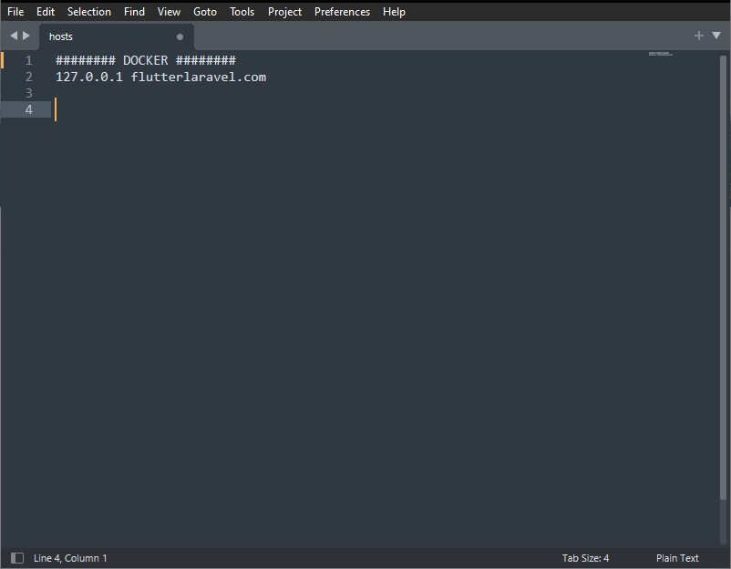

## Flutter Map

This project is a **Flutter** mobile frontend integrated with a **Laravel (PHP)** backend and Google Map API

## Technologies

- **[Flutter](https://flutter.dev/)**
- **[PHP](https://www.php.net/downloads)**
- **[Composer](https://getcomposer.org/)**
- **[Node](https://nodejs.org/es/)** 
- **[Docker Desktop](https://docker.com/products/docker-desktop/)**.

## How to deploy

Inside _laravel_ folder rename  _env.example_  to _.env_. In this file, we must set your database connections.

```env
    DB_CONNECTION=mysql
    DB_HOST=mariadb
    DB_PORT=3306
    DB_DATABASE=flutterlaravel
    DB_USERNAME=root
    DB_PASSWORD=secret
    APP_KEY=
```

Move to the _laravel_ folder and run the following commands in the terminal:

```bash
    composer install
    npm install
    php artisan key:generate
    php artisan migrate:fresh --seed
 ```

Move to _docker_ folder and run:

```bash
    docker compose up -d --build
 ```

You can edit your **/etc/hosts** file to use a custom domain name.



We can access the web in *localhost (127.0.0.1)* or *flutterlaravel.com*.

In `flutter/android/app/src/main/AndroidManifest.xml` replace `android:value="API_KEY"` with your **Google Maps** API key.

To obtain a key, go to **[Google Cloud Platform](https://console.cloud.google.com/)** and create a project and follow [this](https://developers.google.com/maps/documentation/javascript/get-api-key) guide.

Move to flutter folder and launch this commands in terminal.

```bash
    flutter run
```

Can access to **phpMyAdmin** in *localhost:8000*.

> [!NOTE]
> Name: **root**. Password: **secret**


