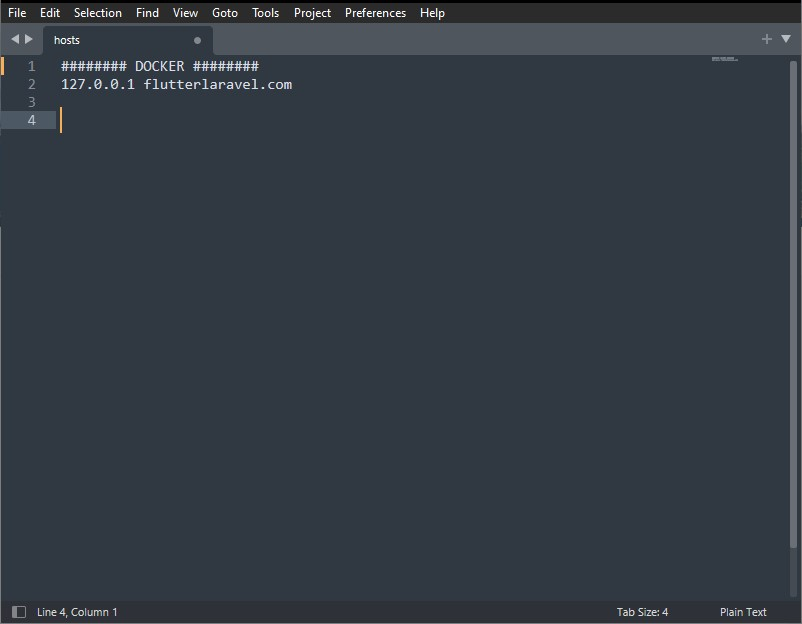

## Guide

Install **[Flutter](https://flutter.dev/)**, **[PHP](https://www.php.net/downloads)**, **[Composer](https://getcomposer.org/)**, **[Node](https://nodejs.org/es/)** and **[Docker Desktop](https://docker.com/products/docker-desktop/)**.

In _laravel_ folder we must copy-paste _env.example_ and rename new file as _.env_. In this file we must set your database connections.

Default connection in _.env_ file for this project.

    DB_CONNECTION=mysql
    DB_HOST=mariadb
    DB_PORT=3306
    DB_DATABASE=flutterlaravel
    DB_USERNAME=root
    DB_PASSWORD=secret
    APP_KEY=

With _CMD_ launch these commands

    cd laravel
    composer install
    npm install
    php artisan key:generate

Open **Docker Desktop**, then with _CMD_ launch these commands

    cd docker
    docker-compose up -d

After all we can edit _etc/host_ file to use a domain name.

We can access the web in localhost (127.0.0.1) or flutterlaravel.com.

### Frontend

**[Flutter](https://flutter.dev/)**

In

> /flutter/android/app/src/main/AndroidManifest.xml

change _android:value="API_KEY"_ for you **Google Maps** API key.

To get a key you must go to **[Google Cloud Platform](https://console.cloud.google.com/)** and create a project. Then follow [this](https://developers.google.com/maps/documentation/javascript/get-api-key) guide.

Finally run

    flutter run

### Backend

**[Laravel](https://laravel.com/)**

Open _www_ docker container.

- Launch

  cd var/www/html
  php artisan migrate:fresh --seed

To access to **phpMyAdmin**

> localhost:8000

## Credentials

- Name: root
- Password: secret
